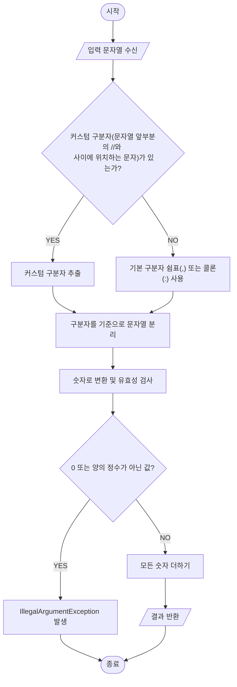
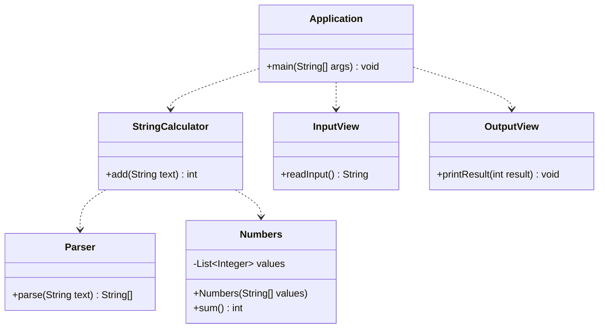

# 문자열 덧셈 계산기

## 소수도 처리할 것인가?

> 결정 : 정수만 처리한다. 요구사항의 '숫자'라는 표현이 모호하다고 생각된다. 과제의 일반적인 의도와 단계적 구현을 고려할 때 정수를 먼저 다루는 것이 합리적이다. 이에 소수점(.)은 숫자가 아닌 문자로 간주하여
`IllegalArgumentException`을 발생시킨다. 소수 처리 기능은 추후 별도의 기능으로 추가할 수 있다.

---

## 구현할 기능 목록

- [x] 쉼표(,) 또는 콜론(:)을 구분자로 가지는 문자열을 전달하는 경우 구분자를 기준으로 분리한 각 숫자의 합을 반환한다.
- [x] `//`와 `\n` 문자 사이에 커스텀 구분자를 지정할 수 있다.
- [x] 문자열 계산기에 0과 양의 정수가 아닌 문자가 포함된 경우 `IllegalArgumentException`을 throw 한다.
- [ ] 입력과 출력을 담당하는 UI 뷰를 구현한다.

---

## 문자열 처리 순서도

---

## 클래스 다이어그램

---
